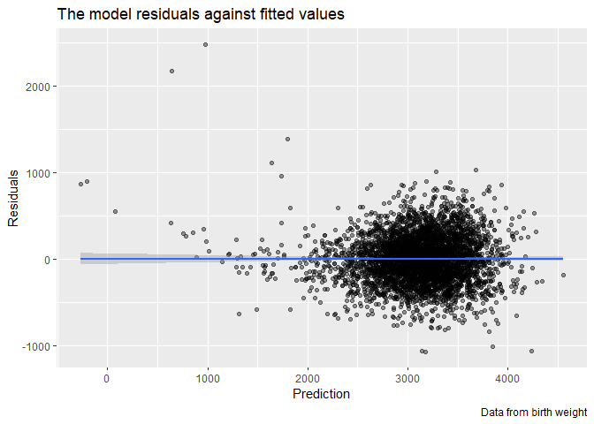

Homework 6
================
Bingkun Luo
11/22/2019

#### Problem 1

##### a

``` r
birth_weight = read_csv("./data/birthweight.csv")%>%
                mutate(babysex = as.factor(babysex),
                       frace = as.factor(frace),
                       malform = as.factor(malform),
                       mrace = as.factor(mrace))
```

    ## Parsed with column specification:
    ## cols(
    ##   .default = col_double()
    ## )

    ## See spec(...) for full column specifications.

``` r
str(birth_weight)
```

    ## Classes 'spec_tbl_df', 'tbl_df', 'tbl' and 'data.frame': 4342 obs. of  20 variables:
    ##  $ babysex : Factor w/ 2 levels "1","2": 2 1 2 1 2 1 2 2 1 1 ...
    ##  $ bhead   : num  34 34 36 34 34 33 33 33 36 33 ...
    ##  $ blength : num  51 48 50 52 52 52 46 49 52 50 ...
    ##  $ bwt     : num  3629 3062 3345 3062 3374 ...
    ##  $ delwt   : num  177 156 148 157 156 129 126 140 146 169 ...
    ##  $ fincome : num  35 65 85 55 5 55 96 5 85 75 ...
    ##  $ frace   : Factor w/ 5 levels "1","2","3","4",..: 1 2 1 1 1 1 2 1 1 2 ...
    ##  $ gaweeks : num  39.9 25.9 39.9 40 41.6 ...
    ##  $ malform : Factor w/ 2 levels "0","1": 1 1 1 1 1 1 1 1 1 1 ...
    ##  $ menarche: num  13 14 12 14 13 12 14 12 11 12 ...
    ##  $ mheight : num  63 65 64 64 66 66 72 62 61 64 ...
    ##  $ momage  : num  36 25 29 18 20 23 29 19 13 19 ...
    ##  $ mrace   : Factor w/ 4 levels "1","2","3","4": 1 2 1 1 1 1 2 1 1 2 ...
    ##  $ parity  : num  3 0 0 0 0 0 0 0 0 0 ...
    ##  $ pnumlbw : num  0 0 0 0 0 0 0 0 0 0 ...
    ##  $ pnumsga : num  0 0 0 0 0 0 0 0 0 0 ...
    ##  $ ppbmi   : num  26.3 21.3 23.6 21.8 21 ...
    ##  $ ppwt    : num  148 128 137 127 130 115 105 119 105 145 ...
    ##  $ smoken  : num  0 0 1 10 1 0 0 0 0 4 ...
    ##  $ wtgain  : num  29 28 11 30 26 14 21 21 41 24 ...

Loaded and checked there is 0 NAs in the imported dataset for the
regression analysis.

##### b

Backward elimination example using step, Fristly remove the entire
categorical variable, since it doesnot make much sense if the model
selection only retain some of the multiple levels.

``` r
mod = lm(bwt~.-babysex-frace-mrace,data = birth_weight)
back = step(mod,direction = c("backward")) 
```

    ## Start:  AIC=48895.82
    ## bwt ~ (babysex + bhead + blength + delwt + fincome + frace + 
    ##     gaweeks + malform + menarche + mheight + momage + mrace + 
    ##     parity + pnumlbw + pnumsga + ppbmi + ppwt + smoken + wtgain) - 
    ##     babysex - frace - mrace
    ## 
    ## 
    ## Step:  AIC=48895.82
    ## bwt ~ bhead + blength + delwt + fincome + gaweeks + malform + 
    ##     menarche + mheight + momage + parity + pnumlbw + pnumsga + 
    ##     ppbmi + ppwt + smoken
    ## 
    ## 
    ## Step:  AIC=48895.82
    ## bwt ~ bhead + blength + delwt + fincome + gaweeks + malform + 
    ##     menarche + mheight + momage + parity + pnumlbw + ppbmi + 
    ##     ppwt + smoken
    ## 
    ## 
    ## Step:  AIC=48895.82
    ## bwt ~ bhead + blength + delwt + fincome + gaweeks + malform + 
    ##     menarche + mheight + momage + parity + ppbmi + ppwt + smoken
    ## 
    ##            Df Sum of Sq       RSS   AIC
    ## - ppbmi     1      3843 335382643 48894
    ## - malform   1     11005 335389804 48894
    ## - mheight   1     82127 335460926 48895
    ## - ppwt      1    133107 335511906 48896
    ## <none>                  335378800 48896
    ## - menarche  1    289499 335668299 48898
    ## - parity    1    436873 335815673 48899
    ## - momage    1   1080371 336459171 48908
    ## - smoken    1   1942132 337320932 48919
    ## - fincome   1   2603365 337982165 48927
    ## - gaweeks   1   6225317 341604117 48974
    ## - delwt     1   7469440 342848240 48989
    ## - blength   1 109777121 445155921 50123
    ## - bhead     1 112968561 448347361 50154
    ## 
    ## Step:  AIC=48893.87
    ## bwt ~ bhead + blength + delwt + fincome + gaweeks + malform + 
    ##     menarche + mheight + momage + parity + ppwt + smoken
    ## 
    ##            Df Sum of Sq       RSS   AIC
    ## - malform   1     10921 335393564 48892
    ## <none>                  335382643 48894
    ## - menarche  1    291714 335674356 48896
    ## - parity    1    435822 335818465 48898
    ## - momage    1   1081746 336464389 48906
    ## - mheight   1   1723826 337106469 48914
    ## - smoken    1   1943772 337326415 48917
    ## - fincome   1   2608545 337991188 48926
    ## - ppwt      1   3359070 338741713 48935
    ## - gaweeks   1   6223136 341605779 48972
    ## - delwt     1   7466992 342849634 48987
    ## - blength   1 109783304 445165947 50121
    ## - bhead     1 113093894 448476537 50154
    ## 
    ## Step:  AIC=48892.02
    ## bwt ~ bhead + blength + delwt + fincome + gaweeks + menarche + 
    ##     mheight + momage + parity + ppwt + smoken
    ## 
    ##            Df Sum of Sq       RSS   AIC
    ## <none>                  335393564 48892
    ## - menarche  1    293247 335686811 48894
    ## - parity    1    435212 335828776 48896
    ## - momage    1   1088124 336481687 48904
    ## - mheight   1   1721642 337115206 48912
    ## - smoken    1   1936489 337330052 48915
    ## - fincome   1   2604115 337997678 48924
    ## - ppwt      1   3373950 338767514 48933
    ## - gaweeks   1   6218410 341611974 48970
    ## - delwt     1   7494272 342887836 48986
    ## - blength   1 109773869 445167433 50119
    ## - bhead     1 113129609 448523173 50152

``` r
summary(back)
```

    ## 
    ## Call:
    ## lm(formula = bwt ~ bhead + blength + delwt + fincome + gaweeks + 
    ##     menarche + mheight + momage + parity + ppwt + smoken, data = birth_weight)
    ## 
    ## Residuals:
    ##      Min       1Q   Median       3Q      Max 
    ## -1077.03  -183.37    -6.72   175.47  2480.37 
    ## 
    ## Coefficients:
    ##               Estimate Std. Error t value Pr(>|t|)    
    ## (Intercept) -6522.1190   136.5123 -47.777  < 2e-16 ***
    ## bhead         132.4074     3.4646  38.217  < 2e-16 ***
    ## blength        77.3399     2.0544  37.646  < 2e-16 ***
    ## delwt           3.9597     0.4026   9.836  < 2e-16 ***
    ## fincome         1.0121     0.1746   5.798 7.18e-09 ***
    ## gaweeks        13.3120     1.4857   8.960  < 2e-16 ***
    ## menarche       -5.7342     2.9471  -1.946 0.051751 .  
    ## mheight         8.4910     1.8010   4.715 2.50e-06 ***
    ## momage          4.4866     1.1971   3.748 0.000181 ***
    ## parity         97.9340    41.3158   2.370 0.017814 *  
    ## ppwt           -2.9103     0.4410  -6.600 4.61e-11 ***
    ## smoken         -2.8879     0.5776  -5.000 5.96e-07 ***
    ## ---
    ## Signif. codes:  0 '***' 0.001 '**' 0.01 '*' 0.05 '.' 0.1 ' ' 1
    ## 
    ## Residual standard error: 278.3 on 4330 degrees of freedom
    ## Multiple R-squared:  0.7054, Adjusted R-squared:  0.7047 
    ## F-statistic: 942.7 on 11 and 4330 DF,  p-value: < 2.2e-16

The model I selected by Backward selection based on AIC is

``` r
fit = lm(bwt~bhead+blength+delwt+fincome+gaweeks+menarche+mheight+momage+parity+ppwt+smoken,data = birth_weight)
fit
```

    ## 
    ## Call:
    ## lm(formula = bwt ~ bhead + blength + delwt + fincome + gaweeks + 
    ##     menarche + mheight + momage + parity + ppwt + smoken, data = birth_weight)
    ## 
    ## Coefficients:
    ## (Intercept)        bhead      blength        delwt      fincome  
    ##   -6522.119      132.407       77.340        3.960        1.012  
    ##     gaweeks     menarche      mheight       momage       parity  
    ##      13.312       -5.734        8.491        4.487       97.934  
    ##        ppwt       smoken  
    ##      -2.910       -2.888

``` r
summary(fit)
```

    ## 
    ## Call:
    ## lm(formula = bwt ~ bhead + blength + delwt + fincome + gaweeks + 
    ##     menarche + mheight + momage + parity + ppwt + smoken, data = birth_weight)
    ## 
    ## Residuals:
    ##      Min       1Q   Median       3Q      Max 
    ## -1077.03  -183.37    -6.72   175.47  2480.37 
    ## 
    ## Coefficients:
    ##               Estimate Std. Error t value Pr(>|t|)    
    ## (Intercept) -6522.1190   136.5123 -47.777  < 2e-16 ***
    ## bhead         132.4074     3.4646  38.217  < 2e-16 ***
    ## blength        77.3399     2.0544  37.646  < 2e-16 ***
    ## delwt           3.9597     0.4026   9.836  < 2e-16 ***
    ## fincome         1.0121     0.1746   5.798 7.18e-09 ***
    ## gaweeks        13.3120     1.4857   8.960  < 2e-16 ***
    ## menarche       -5.7342     2.9471  -1.946 0.051751 .  
    ## mheight         8.4910     1.8010   4.715 2.50e-06 ***
    ## momage          4.4866     1.1971   3.748 0.000181 ***
    ## parity         97.9340    41.3158   2.370 0.017814 *  
    ## ppwt           -2.9103     0.4410  -6.600 4.61e-11 ***
    ## smoken         -2.8879     0.5776  -5.000 5.96e-07 ***
    ## ---
    ## Signif. codes:  0 '***' 0.001 '**' 0.01 '*' 0.05 '.' 0.1 ' ' 1
    ## 
    ## Residual standard error: 278.3 on 4330 degrees of freedom
    ## Multiple R-squared:  0.7054, Adjusted R-squared:  0.7047 
    ## F-statistic: 942.7 on 11 and 4330 DF,  p-value: < 2.2e-16

Plot:

``` r
plot = as_tibble(add_residuals(fit,data=add_predictions(fit,data=birth_weight)))
ggplot(plot, aes(x=pred,y=resid))+
  geom_point(alpha = 0.4)
```

<!-- -->

Other two models:

``` r
fit_1 = lm(bwt~blength+gaweeks,data = birth_weight)
fit_2 = lm(bwt~bhead*blength*babysex,data = birth_weight)
```

Cross validation:

``` r
set.seed(1)
cv_df = 
  crossv_mc(birth_weight,100) 
cv_df =
  cv_df %>% 
  mutate(train = map(train, as_tibble),
         test = map(test, as_tibble))
```

``` r
cv_df = 
  cv_df %>% 
  mutate(fit = map(train,~lm(bwt~bhead+blength 
        +delwt+fincome+gaweeks+menarche+mheight+momage+parity+ppwt+smoken,data = .)),
        fit_1 = map(train,~lm(bwt~blength+gaweeks,data = .)),
        fit_2 = map(train,~lm(bwt~bhead*blength*babysex,data = .))) %>% 
  mutate(rmse_fit = map2_dbl(fit, test, ~rmse(model = .x, data = .y)),
         rmse_fit_1 = map2_dbl(fit_1, test, ~rmse(model = .x, data = .y)),
         rmse_fit_2 = map2_dbl(fit_2, test, ~rmse(model = .x, data = .y)))
```

    ## Warning in predict.lm(model, data): prediction from a rank-deficient fit
    ## may be misleading

``` r
cv_df %>% 
  select(starts_with("rmse")) %>% 
  pivot_longer(
    everything(),
    names_to = "model", 
    values_to = "rmse",
    names_prefix = "rmse_") %>% 
  mutate(model = fct_inorder(model))%>%
  group_by(model)%>%
  summarise(mean_rmse = mean(rmse))%>%
  pivot_wider(names_from = model,values_from = mean_rmse)%>%
  kableExtra::kable(type = "markdown")
```

<table>

<thead>

<tr>

<th style="text-align:right;">

fit

</th>

<th style="text-align:right;">

fit\_1

</th>

<th style="text-align:right;">

fit\_2

</th>

</tr>

</thead>

<tbody>

<tr>

<td style="text-align:right;">

278.7335

</td>

<td style="text-align:right;">

332.2287

</td>

<td style="text-align:right;">

288.603

</td>

</tr>

</tbody>

</table>
