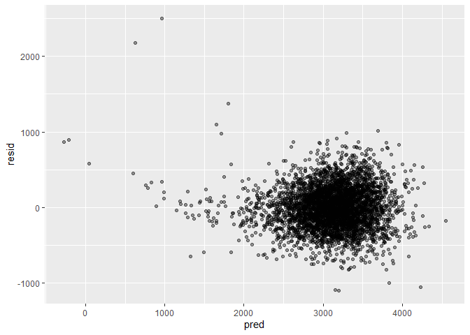

Homework 6
================
Bingkun Luo
11/22/2019

#### Problem 1

##### a

``` r
birth_weight = read_csv("./data/birthweight.csv")%>%
                mutate(babysex = as.factor(babysex),
                       frace = as.factor(frace),
                       malform = as.factor(malform),
                       mrace = as.factor(mrace))
```

    ## Parsed with column specification:
    ## cols(
    ##   .default = col_double()
    ## )

    ## See spec(...) for full column specifications.

``` r
str(birth_weight)
```

    ## Classes 'spec_tbl_df', 'tbl_df', 'tbl' and 'data.frame': 4342 obs. of  20 variables:
    ##  $ babysex : Factor w/ 2 levels "1","2": 2 1 2 1 2 1 2 2 1 1 ...
    ##  $ bhead   : num  34 34 36 34 34 33 33 33 36 33 ...
    ##  $ blength : num  51 48 50 52 52 52 46 49 52 50 ...
    ##  $ bwt     : num  3629 3062 3345 3062 3374 ...
    ##  $ delwt   : num  177 156 148 157 156 129 126 140 146 169 ...
    ##  $ fincome : num  35 65 85 55 5 55 96 5 85 75 ...
    ##  $ frace   : Factor w/ 5 levels "1","2","3","4",..: 1 2 1 1 1 1 2 1 1 2 ...
    ##  $ gaweeks : num  39.9 25.9 39.9 40 41.6 ...
    ##  $ malform : Factor w/ 2 levels "0","1": 1 1 1 1 1 1 1 1 1 1 ...
    ##  $ menarche: num  13 14 12 14 13 12 14 12 11 12 ...
    ##  $ mheight : num  63 65 64 64 66 66 72 62 61 64 ...
    ##  $ momage  : num  36 25 29 18 20 23 29 19 13 19 ...
    ##  $ mrace   : Factor w/ 4 levels "1","2","3","4": 1 2 1 1 1 1 2 1 1 2 ...
    ##  $ parity  : num  3 0 0 0 0 0 0 0 0 0 ...
    ##  $ pnumlbw : num  0 0 0 0 0 0 0 0 0 0 ...
    ##  $ pnumsga : num  0 0 0 0 0 0 0 0 0 0 ...
    ##  $ ppbmi   : num  26.3 21.3 23.6 21.8 21 ...
    ##  $ ppwt    : num  148 128 137 127 130 115 105 119 105 145 ...
    ##  $ smoken  : num  0 0 1 10 1 0 0 0 0 4 ...
    ##  $ wtgain  : num  29 28 11 30 26 14 21 21 41 24 ...

Loaded and checked there is 0 NAs in the imported dataset for the
regression analysis.

##### b

Backward elimination example using step, Fristly remove the entire
categorical variable, since it doesnot make much sense if the model
selection only retain some of the multiple levels.

``` r
mod = lm(bwt~.-frace-mrace,data = birth_weight)
back = step(mod,direction = c("backward")) 
```

    ## Start:  AIC=48884.99
    ## bwt ~ (babysex + bhead + blength + delwt + fincome + frace + 
    ##     gaweeks + malform + menarche + mheight + momage + mrace + 
    ##     parity + pnumlbw + pnumsga + ppbmi + ppwt + smoken + wtgain) - 
    ##     frace - mrace
    ## 
    ## 
    ## Step:  AIC=48884.99
    ## bwt ~ babysex + bhead + blength + delwt + fincome + gaweeks + 
    ##     malform + menarche + mheight + momage + parity + pnumlbw + 
    ##     pnumsga + ppbmi + ppwt + smoken
    ## 
    ## 
    ## Step:  AIC=48884.99
    ## bwt ~ babysex + bhead + blength + delwt + fincome + gaweeks + 
    ##     malform + menarche + mheight + momage + parity + pnumlbw + 
    ##     ppbmi + ppwt + smoken
    ## 
    ## 
    ## Step:  AIC=48884.99
    ## bwt ~ babysex + bhead + blength + delwt + fincome + gaweeks + 
    ##     malform + menarche + mheight + momage + parity + ppbmi + 
    ##     ppwt + smoken
    ## 
    ##            Df Sum of Sq       RSS   AIC
    ## - ppbmi     1      5166 334394285 48883
    ## - malform   1     14352 334403471 48883
    ## - mheight   1     85274 334474393 48884
    ## - ppwt      1    142207 334531326 48885
    ## <none>                  334389119 48885
    ## - menarche  1    285525 334674644 48887
    ## - parity    1    398948 334788067 48888
    ## - babysex   1    989681 335378800 48896
    ## - momage    1   1136673 335525792 48898
    ## - smoken    1   1819670 336208789 48907
    ## - fincome   1   2604605 336993724 48917
    ## - gaweeks   1   5676825 340065944 48956
    ## - delwt     1   7513843 341902962 48979
    ## - blength   1 110148629 444537748 50119
    ## - bhead     1 113598657 447987776 50153
    ## 
    ## Step:  AIC=48883.06
    ## bwt ~ babysex + bhead + blength + delwt + fincome + gaweeks + 
    ##     malform + menarche + mheight + momage + parity + ppwt + smoken
    ## 
    ##            Df Sum of Sq       RSS   AIC
    ## - malform   1     14239 334408523 48881
    ## <none>                  334394285 48883
    ## - menarche  1    288037 334682322 48885
    ## - parity    1    397791 334792075 48886
    ## - babysex   1    988358 335382643 48894
    ## - momage    1   1138246 335532530 48896
    ## - mheight   1   1657843 336052127 48903
    ## - smoken    1   1821578 336215863 48905
    ## - fincome   1   2610438 337004722 48915
    ## - ppwt      1   3414850 337809135 48925
    ## - gaweeks   1   5674584 340068869 48954
    ## - delwt     1   7510880 341905164 48978
    ## - blength   1 110155125 444549409 50117
    ## - bhead     1 113716682 448110966 50152
    ## 
    ## Step:  AIC=48881.24
    ## bwt ~ babysex + bhead + blength + delwt + fincome + gaweeks + 
    ##     menarche + mheight + momage + parity + ppwt + smoken
    ## 
    ##            Df Sum of Sq       RSS   AIC
    ## <none>                  334408523 48881
    ## - menarche  1    289776 334698300 48883
    ## - parity    1    397189 334805712 48884
    ## - babysex   1    985041 335393564 48892
    ## - momage    1   1145497 335554021 48894
    ## - mheight   1   1655484 336064007 48901
    ## - smoken    1   1813343 336221866 48903
    ## - fincome   1   2605294 337013817 48913
    ## - ppwt      1   3431404 337839928 48924
    ## - gaweeks   1   5670026 340078549 48952
    ## - delwt     1   7540825 341949349 48976
    ## - blength   1 110141618 444550141 50115
    ## - bhead     1 113744903 448153426 50150

``` r
summary(back)
```

    ## 
    ## Call:
    ## lm(formula = bwt ~ babysex + bhead + blength + delwt + fincome + 
    ##     gaweeks + menarche + mheight + momage + parity + ppwt + smoken, 
    ##     data = birth_weight)
    ## 
    ## Residuals:
    ##      Min       1Q   Median       3Q      Max 
    ## -1094.89  -181.60    -6.52   175.81  2497.40 
    ## 
    ## Coefficients:
    ##               Estimate Std. Error t value Pr(>|t|)    
    ## (Intercept) -6577.6270   137.2108 -47.938  < 2e-16 ***
    ## babysex2       30.7823     8.6202   3.571 0.000360 ***
    ## bhead         134.2746     3.4992  38.373  < 2e-16 ***
    ## blength        77.4844     2.0520  37.760  < 2e-16 ***
    ## delwt           3.9722     0.4020   9.880  < 2e-16 ***
    ## fincome         1.0123     0.1743   5.807 6.80e-09 ***
    ## gaweeks        12.7763     1.4913   8.567  < 2e-16 ***
    ## menarche       -5.7002     2.9431  -1.937 0.052834 .  
    ## mheight         8.3289     1.7992   4.629 3.78e-06 ***
    ## momage          4.6052     1.1959   3.851 0.000119 ***
    ## parity         93.5986    41.2777   2.268 0.023407 *  
    ## ppwt           -2.9354     0.4404  -6.665 2.98e-11 ***
    ## smoken         -2.7973     0.5773  -4.845 1.31e-06 ***
    ## ---
    ## Signif. codes:  0 '***' 0.001 '**' 0.01 '*' 0.05 '.' 0.1 ' ' 1
    ## 
    ## Residual standard error: 277.9 on 4329 degrees of freedom
    ## Multiple R-squared:  0.7063, Adjusted R-squared:  0.7055 
    ## F-statistic: 867.6 on 12 and 4329 DF,  p-value: < 2.2e-16

Plot:

``` r
plot = as_tibble(add_residuals(mod,data=add_predictions(mod,data=birth_weight)))
```

    ## Warning in predict.lm(model, data): prediction from a rank-deficient fit
    ## may be misleading
    
    ## Warning in predict.lm(model, data): prediction from a rank-deficient fit
    ## may be misleading

``` r
ggplot(plot, aes(x=pred,y=resid))+
  geom_point(alpha = 0.4)
```

<!-- -->

Other two models:

``` r
fit_1 = lm(bwt~blength+gaweeks,data = birth_weight)
fit_2 = lm(bwt~bhead*blength*babysex,data = birth_weight)

summary(fit_1)
```

    ## 
    ## Call:
    ## lm(formula = bwt ~ blength + gaweeks, data = birth_weight)
    ## 
    ## Residuals:
    ##     Min      1Q  Median      3Q     Max 
    ## -1709.6  -215.4   -11.4   208.2  4188.8 
    ## 
    ## Coefficients:
    ##              Estimate Std. Error t value Pr(>|t|)    
    ## (Intercept) -4347.667     97.958  -44.38   <2e-16 ***
    ## blength       128.556      1.990   64.60   <2e-16 ***
    ## gaweeks        27.047      1.718   15.74   <2e-16 ***
    ## ---
    ## Signif. codes:  0 '***' 0.001 '**' 0.01 '*' 0.05 '.' 0.1 ' ' 1
    ## 
    ## Residual standard error: 333.2 on 4339 degrees of freedom
    ## Multiple R-squared:  0.5769, Adjusted R-squared:  0.5767 
    ## F-statistic:  2958 on 2 and 4339 DF,  p-value: < 2.2e-16

``` r
summary(fit_2)
```

    ## 
    ## Call:
    ## lm(formula = bwt ~ bhead * blength * babysex, data = birth_weight)
    ## 
    ## Residuals:
    ##      Min       1Q   Median       3Q      Max 
    ## -1132.99  -190.42   -10.33   178.63  2617.96 
    ## 
    ## Coefficients:
    ##                          Estimate Std. Error t value Pr(>|t|)    
    ## (Intercept)            -7176.8170  1264.8397  -5.674 1.49e-08 ***
    ## bhead                    181.7956    38.0542   4.777 1.84e-06 ***
    ## blength                  102.1269    26.2118   3.896 9.92e-05 ***
    ## babysex2                6374.8684  1677.7669   3.800 0.000147 ***
    ## bhead:blength             -0.5536     0.7802  -0.710 0.478012    
    ## bhead:babysex2          -198.3932    51.0917  -3.883 0.000105 ***
    ## blength:babysex2        -123.7729    35.1185  -3.524 0.000429 ***
    ## bhead:blength:babysex2     3.8781     1.0566   3.670 0.000245 ***
    ## ---
    ## Signif. codes:  0 '***' 0.001 '**' 0.01 '*' 0.05 '.' 0.1 ' ' 1
    ## 
    ## Residual standard error: 287.7 on 4334 degrees of freedom
    ## Multiple R-squared:  0.6849, Adjusted R-squared:  0.6844 
    ## F-statistic:  1346 on 7 and 4334 DF,  p-value: < 2.2e-16

Cross validation:
